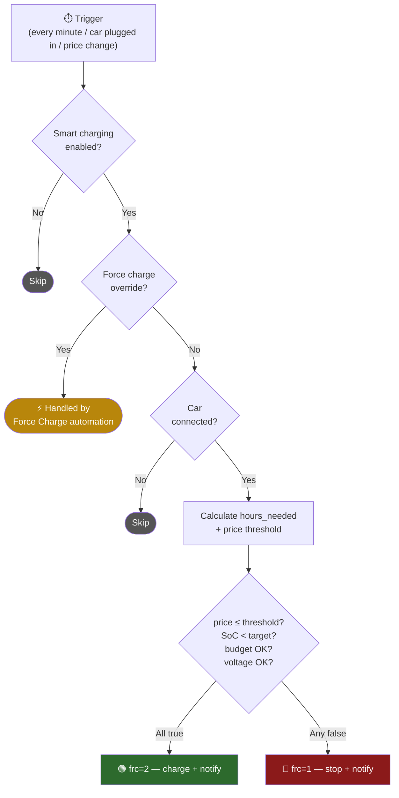
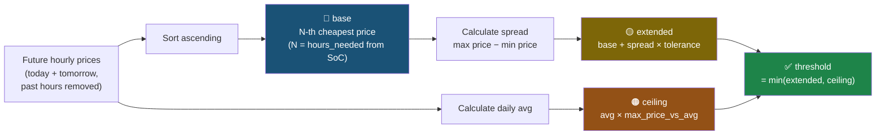
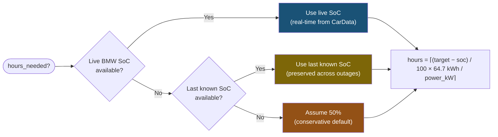

# ha-cost-optimized-ev-charging

Smart EV charging automation for Home Assistant using Tibber dynamic pricing, go-eCharger API v2, and BMW CarData integration.

## Features

- **Dynamic scheduling** — automatically calculates required charging hours from SoC (live → last known → 50% fallback) and charges only during the cheapest matching window using a "Natural Cheap Window" algorithm (base + spread × tolerance + daily-avg ceiling)
- **Live-price decisions** — scheduler compares against the live Tibber price, not just the hourly sample, so it reacts to intra-hour price drops
- **SoC-based stop** — stops charging when battery reaches target SoC (default 100%)
- **Dynamic hour calculation** — automatically computes how many cheap hours are needed based on current SoC and target (no manual slider — hours are derived entirely from SoC)
- **Overnight charging** — combines today + tomorrow prices for optimal scheduling across midnight
- **Monthly EV cost budget** — tracks EV-specific cost and stops when budget is reached
- **Negative price handling** — fully supports negative energy prices. Charging during negative prices correctly *reduces* your accumulated monthly cost and frees up budget.
- **BMW CarData integration** — live SoC, range, charging state via MQTT
- **Dynamic consumption tracking** — calculates real-time vehicle efficiency (kWh/100km) directly from BMW's internal range estimates to keep range forecasts highly accurate across seasons.
- **Charging efficiency tracking** — compares wallbox power vs BMW-reported battery power (shows losses)
- **Plug-in reminder** — push notification at 22:00 if car is home but not plugged in and SoC is low
- **Monthly report** — automated summary on the 1st of each month (kWh, EUR, km, avg price)
- **Tomorrow preview** — shows tomorrow's cheapest hours and expected price (available after ~13:00)
- **Next cheap hour** — tells you when the next charging window starts
- **Cost forecast** — projects current spending to end of month
- **ETA to target** — shows estimated time when target SoC will be reached
- **Session logging** — logs energy, cost, and totals on every disconnect
- **Voltage protection** — progressive action on low grid voltage (warn → reduce current → stop)
- **Force charge override** — manual dashboard toggle to bypass scheduling
- **Push notifications** — iPhone alerts on charge start/stop, voltage events, car connect/disconnect
- **Powerline/WiFi flap protection** — debounced car-connected sensor + FRC watchdog prevent ghost connect/disconnect notifications and unintended micro-charges when the go-eCharger WiFi drops out
- **Range estimation** — shows potential kWh and km based on configured cheap hours and current
- **Fallback pricing** — if price cache is unavailable, uses current price vs daily average

## Requirements

- [ha-goecharger-api2](https://github.com/marq24/ha-goecharger-api2) custom component (HACS)
- [Tibber](https://www.home-assistant.io/integrations/tibber/) official integration with Pulse
- [BMW CarData](https://github.com/kvanbiesen/bmw-cardata-ha) custom component (HACS) — for SoC
- iOS Companion App for push notifications

## Quick Start

```bash
# 1. Clone the repo
git clone https://github.com/nodomain/ha-cost-optimized-ev-charging.git
cd ha-cost-optimized-ev-charging

# 2. Create your .env from the example
cp .env.example .env
# Edit .env with your entity IDs (serial, tibber home slug, iphone device name).
# Optional: set HA_CONFIG_SMB_URL for auto-mount and HA_URL + HA_TOKEN for
# dashboard auto-push (see comments in .env.example).

# 3. Deploy to your HA config volume
./deploy.sh                   # uses HA_CONFIG_MOUNT from .env (default /Volumes/config)
./deploy.sh /Volumes/config   # or pass the target explicitly
./deploy.sh --reload          # deploy + homeassistant.reload_all (if package changed)
./deploy.sh --restart         # deploy + homeassistant.restart (if package changed)

# 4. Add to configuration.yaml:
#    homeassistant:
#      packages:
#        ev_goe_tibber: !include ha-cost-optimized-ev-charging/ev-goe-tibber.yaml

# 5. Restart Home Assistant

# 6. Dashboard
#    - If HA_URL + HA_TOKEN are set in .env, deploy.sh auto-pushes the
#      dashboard via the HA WebSocket API (requires `uv`). Create the target
#      dashboard once via the HA UI (URL path: ev-charging) — subsequent
#      deploys keep it in sync.
#    - Otherwise paste ev-goe-tibber-dashboard.yaml into a new manual
#      dashboard's raw config editor.
```

## Configuration

All parameters are adjustable from the HA dashboard at runtime:

| Parameter | Default | Description |
|---|---|---|
| Target SoC | 100% | Stop charging when battery reaches this level |
| Monthly budget | 50 EUR | Max EV charging spend per month |
| Cheap price tolerance | 20% | Fraction of price spread (max−min) added to the base threshold — catches clustered near-cheap hours; works safely with negative prices |
| Max price vs daily avg | 0.9 | Hard ceiling: never charge above this fraction of the day's average price, regardless of need or tolerance |
| Normal current | 10 A | Standard charging current (Schuko) |
| Safe current | 6 A | Reduced current on low voltage |
| Voltage warn | 215 V | Notification threshold |
| Voltage reduce | 210 V | Current reduction threshold |
| Voltage stop | 208 V | Force-stop threshold |

**Note:** The scheduler dynamically calculates how many hours are actually needed based on current SoC → target SoC at the configured charging power. There is no manual "cheap hours" cap — hours are derived entirely from the SoC chain (live BMW → last known → 50% fallback).

## How It Works

### Scheduler Decision Flow



### Three-Layer Price Threshold



### SoC Fallback Chain



### Price Data

Prices come from the **official Tibber integration** via `tibber.get_prices` service (15-minute resolution). A trigger-based template sensor (`sensor.ev_price_cache`) fetches and caches hourly prices every 15 minutes. No REST sensor needed.

**Fallback:** If the price cache is unavailable (API timeout), the scheduler compares the current live price against the daily average from `sensor.electricity_price_*` attributes.

### Scheduling Logic

The scheduler runs every minute (plus on car connect and price change) and uses a
**"Natural Cheap Window"** three-layer price threshold:

```
1. base     = N-th cheapest future price  (N = hours_needed from SoC, no manual cap)
2. extended = base + spread × tolerance   (spread = max−min of future prices; negative-price safe)
3. ceiling  = daily_avg × max_vs_avg      (hard safety cap — never above X% of daily average)

final_threshold = min(extended, ceiling)
```

This approach automatically adapts to the price landscape:
- **Spiky days** (e.g. cheap valley 0.04 € + peak 0.43 €): large spread means tolerance expands well around the valley to capture clustered cheap hours.
- **Flat days** (e.g. all hours 0.25–0.30 €): small spread keeps the threshold tight; ceiling clamps to ~90% of the day's average, preventing pointless charging during expensive hours just because we "need" more.

Every minute (+ on car connect, + on price change):
```
  1. Read cached hourly prices (today + tomorrow if available); slice off past hours (future-only)
  2. Calculate hours_needed from SoC chain: (target_soc - current_soc) / 100 × 64.7 kWh / charge_power
  3. Compute base threshold = N-th cheapest future price (N = hours_needed from SoC)
  4. Compute extended threshold = base + spread × tolerance (spread = max − min of future prices)
  5. Compute ceiling = daily_avg × max_price_vs_avg
  6. Final threshold = min(extended, ceiling)
  7. Check: current hour price ≤ final threshold?
  8. Check: SoC < target? (BMW CarData)
  9. Check: monthly EV cost < budget?
  10. Check: voltage OK?
  11. All true → frc=2 (force charge) + iPhone notification
  12. Any false → frc=1 (force stop) + notification (on transition only)
```

### Overnight Charging

When tomorrow's prices are available (after ~13:00), the scheduler combines today + tomorrow
into a 48-hour window. This means if the cheapest hours span midnight (e.g. 23:00–03:00),
the car will charge through the night without interruption.

### Force Charge Control

- `frc=2` → force start (cheap hour + budget OK + SoC below target)
- `frc=1` → force stop (price too high / budget exceeded / voltage low / SoC reached)
- `frc=0` → neutral (only when car disconnected)

**Important:** `frc=0` does NOT stop charging — it lets the wallbox decide on its own.
The automation always uses `frc=1` to actively prevent charging during expensive hours.

## File Structure

```
├── README.md
├── .env.example                           # Template for personal config
├── .gitignore                             # Excludes .env
├── deploy.sh                              # SMB auto-mount + envsubst + API push
├── packages/
│   └── ev-goe-tibber.yaml.tpl             # HA package template
├── dashboard/
│   ├── ev-goe-tibber-dashboard.yaml.tpl   # Dashboard template (2 views)
│   └── ev-widget-card.yaml.tpl            # Compact widget for wall displays
└── tools/
    └── ha_update_dashboard.py             # Lovelace WebSocket API updater (uv run)
```

## Environment Variables (.env)

### Required

| Variable | Example | Description |
|---|---|---|
| `GOE_SERIAL` | `123456` | go-eCharger serial (from entity IDs like `sensor.goe_XXXXXX_nrg_11`) |
| `TIBBER_HOME` | `musterstrasse_1` | Tibber home slug (from `sensor.electricity_price_XXXXX`) |
| `IPHONE_DEVICE` | `my_iphone` | iPhone device name (from `notify.mobile_app_XXXXX`) |
| `TIBBER_GRAPH_CAMERA` | `camera.tibber_graph_musterstrasse_1` | Tibber graph camera entity |

### Optional — auto-mount (macOS)

| Variable | Example | Description |
|---|---|---|
| `HA_CONFIG_MOUNT` | `/Volumes/config` | Target mount point (also the default deploy target) |
| `HA_CONFIG_SMB_URL` | `smb://ha@192.168.1.10/config` | SMB URL used to auto-mount via `osascript` when the mount is missing. macOS Keychain supplies the password — mount once manually in Finder with "Remember password". |

### Optional — dashboard auto-push

| Variable | Example | Description |
|---|---|---|
| `HA_URL` | `http://192.168.1.10:8123` | HA base URL for the WebSocket API |
| `HA_TOKEN` | `eyJhbGciOi...` | Long-lived access token (Profile → Security) |
| `HA_DASHBOARD_URL_PATH` | `ev-charging` | Target dashboard's URL path (default: `ev-charging`) |

When `HA_URL` and `HA_TOKEN` are set, `deploy.sh` pushes the rendered dashboard to HA via the Lovelace WebSocket API (requires [`uv`](https://docs.astral.sh/uv/)). The target dashboard must already exist — create it once via the HA UI.

They also enable the `--reload` / `--restart` flags, which only fire when the generated `ev-goe-tibber.yaml` differs from what's already on disk (use `--force` to bypass the check). Dashboard-only changes are applied in place by the API push — no HA reload needed.

## Sensors Created

### Price Cache

| Entity | Description |
|---|---|
| `sensor.ev_price_cache` | Trigger-based sensor caching hourly prices from official Tibber integration |

### Scheduling & Planning

| Entity | Description |
|---|---|
| `sensor.ev_hours_needed` | Dynamic: hours needed from current SoC to target at configured power (SoC chain: live → last known → 50% fallback) |
| `sensor.ev_last_known_soc` | Preserves last valid BMW SoC across unavailability periods |
| `sensor.ev_estimated_full_time` | ETA: clock time when target SoC will be reached |
| `sensor.ev_charging_efficiency` | Wallbox→battery efficiency in % (BMW power / wallbox power) |
| `sensor.ev_expected_price_today` | Avg price of today's X cheapest hours |
| `sensor.ev_cheap_hours_remaining` | How many cheap hours are left today |
| `sensor.ev_potential_energy_today` | Remaining kWh possible today |
| `sensor.ev_potential_range_today` | Remaining km possible today |
| `sensor.ev_next_cheap_hour` | "now" / "HH:00" / "tomorrow" |
| `sensor.ev_tomorrow_cheapest_hours` | Tomorrow's cheap hour indices |
| `sensor.ev_tomorrow_expected_price` | Avg price of tomorrow's X cheapest hours |
| `sensor.ev_monthly_cost_forecast` | Projected monthly cost based on current pace |
| `sensor.ev_monthly_range_forecast` | Projected monthly range (budget-limited) |
| `sensor.ev_charge_price_threshold` | **Live threshold** the scheduler compares against. Attributes: `base`, `extended`, `ceiling`, `winner` (which layer is active) |
| `sensor.ev_charge_daily_avg` | Arithmetic mean of today's hourly prices |

### Flap Protection (Powerline/WiFi)

| Entity | Description |
|---|---|
| `binary_sensor.ev_car_connected_stable` | Debounced mirror of `binary_sensor.goe_*_car_0` with `delay_on`/`delay_off` = 1 min + `availability` gating. Notifications trigger on this, not the raw sensor. |
| `sensor.ev_session_energy_last_known` | Last good `wh` reading while the car is plugged in. Survives transient WiFi outages so disconnect notifications don't show "Session: 0.0 kWh". |

### Cost & Energy Tracking

| Entity | Description |
|---|---|
| `sensor.ev_charging_cost_rate` | Instantaneous cost rate (EUR/h) |
| `sensor.ev_charging_cost_total` | Accumulated total EV cost (EUR) |
| `sensor.ev_charging_cost_monthly` | EV cost this month (resets 1st) |
| `sensor.ev_charging_cost_quarterly` | EV cost this quarter |
| `sensor.ev_charging_cost_yearly` | EV cost this year |
| `sensor.ev_energy_monthly` | EV energy this month (kWh) |
| `sensor.ev_energy_quarterly` | EV energy this quarter |
| `sensor.ev_energy_yearly` | EV energy this year |
| `sensor.ev_average_price_per_kwh_monthly` | Avg price paid per kWh this month |

### Voltage Monitoring

| Entity | Description |
|---|---|
| `sensor.ev_voltage_status` | ok / warning / reduce / critical |
| `sensor.ev_house_voltage_l1` | Grid voltage L1 |
| `binary_sensor.ev_voltage_warning_zone` | Voltage in warning range |
| `binary_sensor.ev_voltage_reduce_zone` | Voltage in reduce range |
| `binary_sensor.ev_voltage_critical_zone` | Voltage in critical range |

## Automations

| ID | Trigger | Action |
|---|---|---|
| `ev_smart_charge_scheduler` | Every min + car connect + price change | Start/stop based on live price vs threshold + budget + SoC + voltage |
| `ev_frc_watchdog` | `select.goe_*_frc` transitions to `0` | Re-runs scheduler when the go-eCharger auto-resets `frc` after a Powerline-induced API timeout, preventing unintended charging during Neutral-mode default behaviour |
| `ev_force_charge_on/off` | Dashboard toggle | Manual override |
| `ev_voltage_*` | Voltage thresholds | Warn → reduce → stop → restore |
| `ev_car_connected` | Debounced car-plugged (stable for 1 min) | Notify with price + budget info |
| `ev_car_disconnected` | Debounced car-unplugged (stable for 1 min) | Session log (uses last-known kWh) + reset + notify |
| `ev_forgot_to_plug_in` | 22:00 daily | Remind if car is home, not plugged in, SoC below target |
| `ev_monthly_report` | 1st of month, 08:00 | Push summary: kWh, EUR, km, avg price |
| `ev_ha_start_reset` | HA boot | Reset force charge toggle |

## Dashboard

Two views optimized for readability:

**View 1: Charging** (daily use)
- Tibber price graph
- Charger status (car, mode, current, power, session)
- BMW iX1 status (SoC, target, range, charging power, state, time to full, mileage)
- SoC gauge
- Smart charging info (hours needed, ETA, efficiency, cost rate)
- Budget gauge + monthly cost/energy
- Scheduling (target SoC, hours needed, next cheap hour, potential energy/range)
- Tomorrow preview
- Cost forecast
- Quick action buttons (Smart Charging / Force Charge)

**View 2: Settings** (configure once)
- Voltage protection thresholds
- Charging parameters
- Detailed Tibber/Grid entities
- Voltage gauges + history
- SoC history (48h)
- Charging efficiency history (24h)
- Cost & energy summary (monthly/quarterly/yearly)
- Statistics bar charts

## Widget Card

A compact single-line status bar for wall displays, only visible when car is plugged in:

```
🟢 2.1 kW · 59%→80% · 201 km · 14.5 ct · +3.4 kWh · noch 5h
```

Adapts to state:
- **Charging:** power (bold), SoC→target, range, price, session kWh, remaining cheap hours
- **Target reached:** SoC, range, checkmark
- **Paused:** SoC, range, session kWh, next cheap slot
- **Idle:** SoC, range, price, next slot, potential km

## Voltage Protection

| Voltage | Status | Action |
|---|---|---|
| > 215 V | ok | Normal charging |
| ≤ 215 V (2 min) | warning | iPhone notification |
| ≤ 210 V (30 sec) | reduce | Current reduced to 6 A |
| ≤ 208 V (20 sec) | critical | Charging force-stopped |
| > 215 V (3 min) | recovered | Current restored to 10 A |

## Cost Tracking

```
Charging power (W) × Electricity price (EUR/kWh) = Cost rate (EUR/h)
  → Riemann sum integration → Total cost (EUR)
    → Utility meters → Monthly / Quarterly / Yearly
```

On each car disconnect, a session summary is logged:
- Session energy (kWh) and estimated cost (EUR)
- Monthly totals
- HA event `ev_charging_session_complete` fired (visible in logbook)

## Hardware

- **Wallbox:** go-eCharger V4, 11 kW, single-phase (Schuko), local WebSocket
- **Vehicle:** BMW iX1 xDrive30 (64.7 kWh usable battery, iDrive 7+)
- **Energy provider:** Tibber with Pulse (15-min dynamic pricing, Germany)
- **Smart meter:** Tibber Pulse (real-time voltage and consumption)
- **Notifications:** iOS Companion App (iPhone)

## License

MIT
